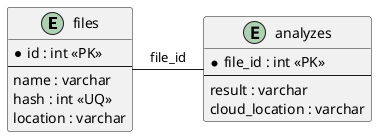
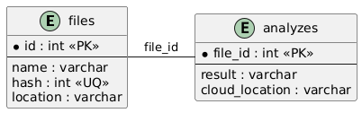

# Отчёт по системе антиплагиата HSE (БД часть)

## 1. Назначение системы
**Целевая аудитория:** 
- Преподаватели и учебные заведения
- Студенты (для самопроверки)

**Сценарии использования:**
1. Проверка уникальности студенческих работ
2. Анализ текстовых документов
3. Визуализация частоты слов через облако тегов
4. Хранение и управление учебными материалами

## 2. Требования

### Функциональные требования:
1. Загрузка текстовых файлов (только .txt, ≤4 МБ)
2. Проверка уникальности по хешу содержимого
3. Анализ текста (подсчёт символов, слов, параграфов)
4. Генерация облака слов через внешний сервис
5. Хранение метаданных файлов и результатов анализа
6. Поиск файлов по ID
7. Обработка ошибок генерации облака слов

### Нефункциональные требования:
1. Отказоустойчивость (retry-механизмы для gRPC)
2. Производительность (кеширование результатов анализа)
3. Масштабируемость (микросервисная архитектура)
4. Безопасность (валидация входных данных)
5. Надёжность хранения (тома Docker)

## 3. Схема БД

### ER-диаграмма (PlantUML)





### Описание сущностей
**files (File Storing Service):**
- id - первичный ключ
- name - имя файла
- hash - хеш содержимого
- location - путь к файлу в хранилище

**analyzes (File Analysis Service):**
- file_id - первичный ключ (логическая связь с files.id)
- result - результаты анализа
- cloud_location - путь к облаку слов

## 4. Ограничения данных

### Функциональные зависимости
**Для таблицы files:**
1. id → {name, hash, location}
2. hash → id (детерминант)

**Для таблицы analyzes:**
1. file_id → {result, cloud_location}

## 5. Нормализация

### Нормализованная схема (5НФ)
```sql
-- File Storing Service
CREATE TABLE files (
    id INT PRIMARY KEY AUTO_INCREMENT,
    name VARCHAR(255) NOT NULL,
    hash INT NOT NULL UNIQUE,
    location VARCHAR(255) NOT NULL
);

-- File Analysis Service
CREATE TABLE analyzes (
    file_id INT PRIMARY KEY,
    result VARCHAR(255) NOT NULL,
    cloud_location VARCHAR(255),
);
```

### Недонормализованная схема (1НФ)
```sql
CREATE TABLE files_analyzes (
    id INT PRIMARY KEY AUTO_INCREMENT,
    name VARCHAR(255) NOT NULL,
    hash INT NOT NULL,
    location VARCHAR(255) NOT NULL,
    result VARCHAR(255) NOT NULL,
    cloud_location VARCHAR(255)
);
```

### Примеры аномалий через SQL

**1. Аномалия удаления (Delete Anomaly)**
```sql
-- Для нормализованной схемы (без потерь):
DELETE FROM analyzes 
WHERE file_id = 1;
-- Файл остаётся в таблице files

-- Для недонормализованной схемы (проблема):
DELETE FROM files_analyzes 
WHERE id = 1 AND result LIKE 'Chars: 1500%';
-- Удалится вся информация о файле, включая location и hash
```

**2. Аномалия вставки (Insert Anomaly)**
```sql
-- Для нормализованной схемы (корректная вставка):
INSERT INTO files (name, hash, location)
VALUES ('new_file.txt', -123456789, '/storage/new_file.txt');

-- Для недонормализованной схемы (проблема):
-- Невозможно добавить файл без анализа
INSERT INTO files_analyzes (name, hash, location)
VALUES ('new_file.txt', -123456789, '/storage/new_file.txt');
-- Ошибка: поле result NOT NULL
```

### Преимущества нормализации

1. **Согласованность данных**:
```sql
-- Автоматическая проверка через FOREIGN KEY
INSERT INTO analyzes 
VALUES (999, 'Chars: 0', null); 
-- Ошибка: нарушение внешнего ключа (файла 999 не существует)

-- В недонормализованной схеме:
INSERT INTO files_analyzes 
VALUES (999, 'ghost.txt', 0, '/nowhere', 'Fake analysis', null);
-- Нет механизма проверки существования файла
```

### Выводы
Нормализация через SQL DDL позволяет:
- Избежать аномалий модификации данных
- Обеспечить целостность через FOREIGN KEY
- Уменьшить избыточность хранения
- Упростить поддержку схемы БД
- Гарантировать согласованность между сервисами

## 6. SQL DDL

```sql
-- File Storing Service
CREATE TABLE files (
    id INT PRIMARY KEY AUTO_INCREMENT,
    name VARCHAR(255) NOT NULL,
    hash INT NOT NULL UNIQUE,
    location VARCHAR(255) NOT NULL
);

-- File Analysis Service
CREATE TABLE analyzes (
    file_id INT PRIMARY KEY,
    result VARCHAR(255) NOT NULL,
    cloud_location VARCHAR(255)
);
```

## 7. SQL DML

### Основные операции
```sql
-- Загрузка файла
INSERT INTO files (name, hash, location)
VALUES ('report.txt', -1942896870, '/storage/report.txt');

-- Получение содержимого файла
SELECT location FROM files WHERE id = 1;

-- Сохранение результатов анализа
INSERT INTO analyzes (file_id, result, cloud_location)
VALUES (1, 'Chars: 1500, Words: 300', '/storage/wordcloud_1.png');

-- Обновление cloud_location при ошибке
UPDATE analyzes SET cloud_location = NULL WHERE file_id = 1;

-- Получение результатов анализа
SELECT a.result, a.cloud_location 
FROM analyzes a
JOIN files f ON a.file_id = f.id
WHERE f.hash = -1942896870;
```

### Транзакции
```sql
-- Транзакция для загрузки файла и анализа
START TRANSACTION;

INSERT INTO files (name, hash, location)
VALUES ('thesis.txt', 123456789, '/storage/thesis.txt');

INSERT INTO analyzes (file_id, result)
VALUES (LAST_INSERT_ID(), 'Chars: 4500, Words: 900');

COMMIT;
```

## 8. Пользовательский интерфейс
- REST API через Swagger UI
- gRPC для межсервисного взаимодействия
- Автоматическая документация API
- Формат ответов:
  ```json
  {
    "fileId": 42,
    "analysis": "Chars: 1500, Words: 300",
    "wordCloudUrl": "/storage/wordcloud_42.png"
  }
  ```

## 9. Дополнительные аспекты

### Индексы
```sql
CREATE INDEX idx_files_hash ON files(hash);
CREATE INDEX idx_analyzes_file_id ON analyzes(file_id);
```

### Статистика
```sql
-- Количество проанализированных файлов
SELECT COUNT(*) FROM analyzes;

-- Получения результата анализа
SELECT result FROM analyzes WHERE id = 5;
```

## 10. Выводы
1. Система соответствует требованиям 5НФ
2. Реализованы механизмы предотвращения аномалий
3. Логическая связь между сервисами через ID файлов
4. Обеспечена целостность данных через уникальные ограничения
5. Оптимизированы запросы через индексы
